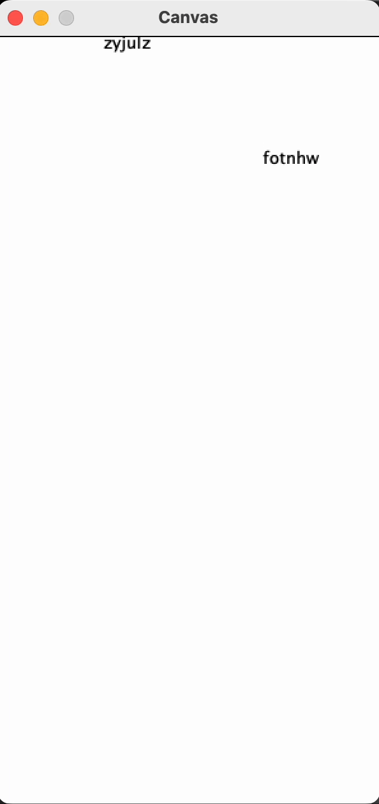

<h1 align="center">ZType</h1>

  

This is ZType! Ztype is a simple typing practice game where the only objective is to, well, type! Once you start the game by running the program, just start typing by of the randomly generated 6 character text blocks. Once you have started a word, you will be "locked" into finishing that word, signaled by the text turning red, as shown in the gif. The game is well endless so try to type for as long as you can! 

## ‼️Disclaimer‼️

This code is not to be used for college assignments. The code is uploaded to my github as part of my portfolio, but as you all know, this code may not be used as plagiarism and I do not conde any acts made through the **theft** of this code. Other than that though, enjoy!

